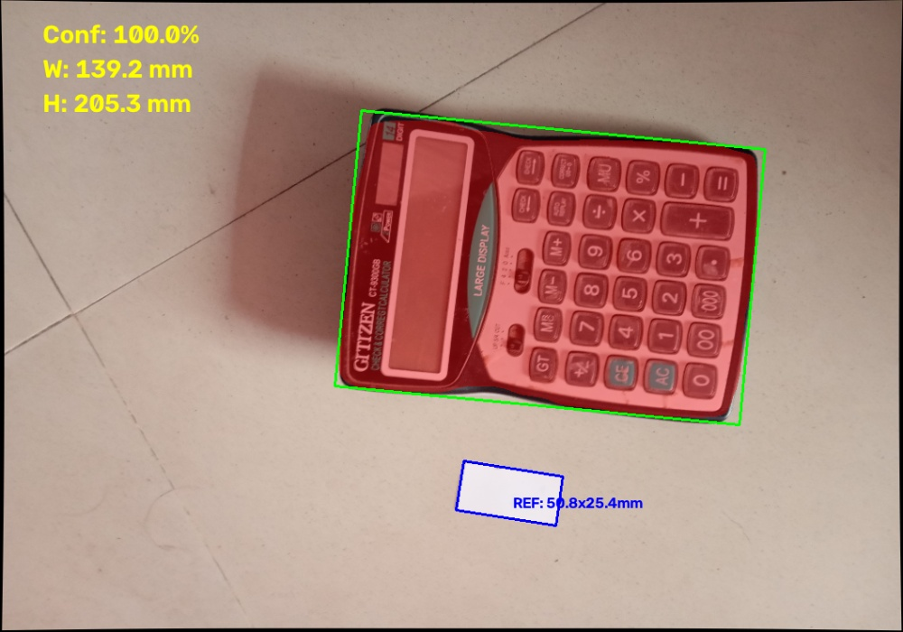
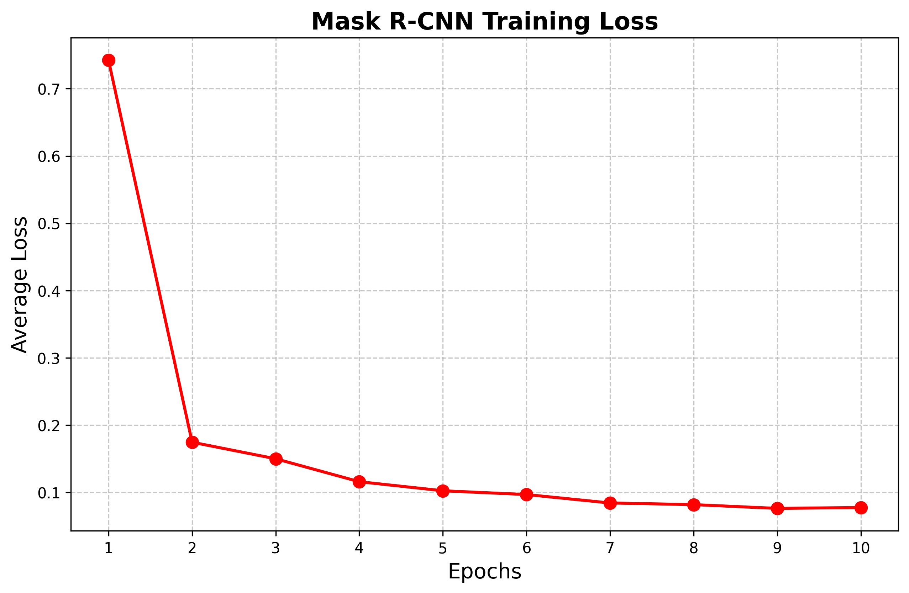

# Calibrated Measurement System 📏

An end-to-end computer vision pipeline that utilizes Deep Learning (Mask R-CNN) and classical Image Processing (OpenCV) to accurately segment target objects and calculate their real-world spatial dimensions in millimeters.

## 🚀 Project Overview
This project was engineered to solve perspective distortion and spatial scaling in 2D images. By applying a robust camera calibration matrix and utilizing a dynamic reference object, the system successfully extracts metric measurements (mm) from standard monocular images.

**Key Features:**
*   **Camera Calibration:** Reduces barrel/pincushion distortion using a 20+ image checkerboard dataset (Achieved Reprojection Error: 0.31).
*   **Instance Segmentation:** Custom-trained PyTorch Mask R-CNN with a ResNet-50-FPN backbone for pixel-perfect object masking.
*   **Hybrid Measurement Pipeline:** Combines AI segmentation for the target object with classical edge-detection/contouring for a calibrated 1x2 inch reference cardboard.

---

## 📊 Visual Demonstrations

### 1. Final Pipeline Output (Metric Calculation)
The AI identifies the target object (Calculator - Red Mask/Green Box), while OpenCV isolates the reference object (Blue Box) to compute the dynamic `pixels_per_mm` ratio.



### 2. Model Training Performance
The custom PyTorch training loop was optimized using Stochastic Gradient Descent (SGD). Below is the training loss curve over 10 epochs.



---

## 🗂️ Data & Weights (Google Drive)
Due to GitHub's file size limits, all heavy assets including raw calibration images, the complete COCO dataset, and the trained PyTorch `.pth` model weights are securely hosted on Google Drive.

🔗 **[Access the Complete Project Data Here](https://drive.google.com/drive/folders/1HfMM4dXCaJDvGgkTwFjAnCsCOInjOX6Q?usp=sharing)**

**Drive Folder Structure:**
1.  `1_Calibration_Images/`: Raw checkerboard images and `camera_params.npz`.
2.  `2_Dataset/`: Zipped Train, Valid, and Test folders with COCO JSON annotations.
3.  `3_Model_Weights/`: The fully trained `simple_calculator_model.pth` file.
4.  `4_Inference_Outputs/`: High-resolution validation images and metric outputs.

---

## 💻 Installation & Usage

**1. Clone the Repository:**
```bash
git clone [https://github.com/yourusername/Calibrated-Measurement-System.git](https://github.com/yourusername/Calibrated-Measurement-System.git)
cd Calibrated-Measurement-System
```

**2. Install Dependencies:**
Ensure you have Python 3.8+ installed. 
```bash
pip install -r requirements.txt
```

**3. Run the Measurement Pipeline:**
Download the model weights and calibration file from the Google Drive link and place them in their respective directories. Then execute:
```bash
python measurement/measure.py
```

---

## 📑 Documentation Reports
For a deep dive into the methodology, mathematics, and metrics behind this pipeline, please review the dedicated markdown reports included in this repository:
*   📄 `CALIBRATION_REPORT.md`
*   📄 `TRAINING_REPORT.md`
*   📄 `MEASUREMENT_REPORT.md`

---

## 👨‍💻 About the Author
**Absar Alam** 
*AI Engineer & Python Developer*
BS in Artificial Intelligence, Quaid-e-Awam University of Engineering, Sciences and Technology.
With over 5 years of professional experience, I specialize in building end-to-end AI pipelines, custom workflows, and deploying robust computer vision systems.